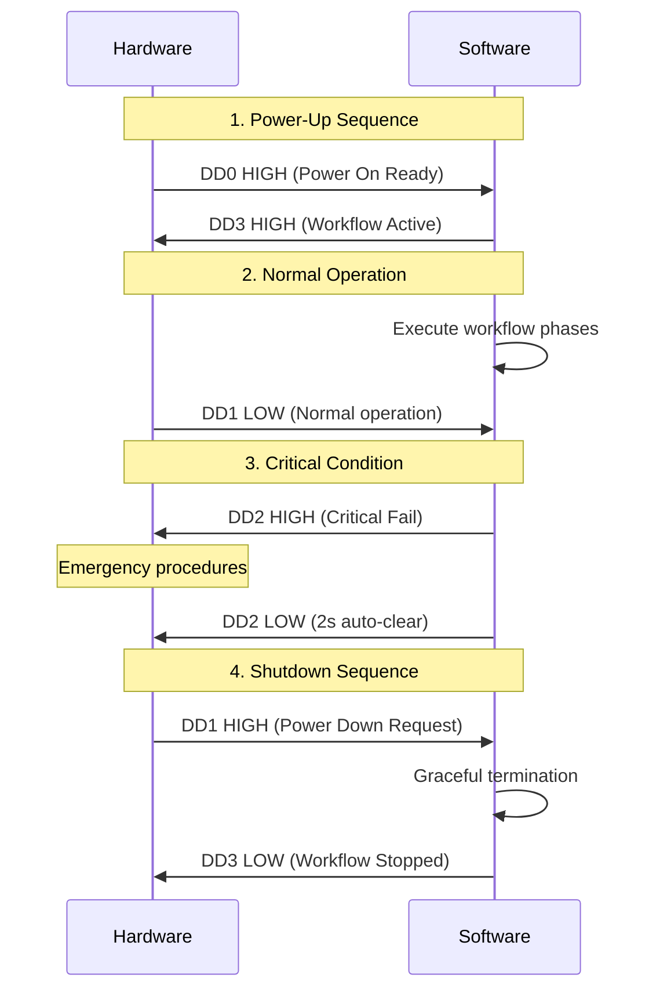

# FT4232HA Hardware Interface Specification 🔌


## 🎯 **Overview for Hardware Team**

This document specifies the **FT4232HA Mini Module Port D GPIO interface** used for client workflow control. Port D is dedicated exclusively to GPIO operations, providing 4 dedicated pins for workflow signaling between software and hardware systems.

---

## 🔌 **Physical Hardware Specifications**

### **FT4232HA Mini Module**
- **Chip**: FT4232HA (USB Hi-Speed, 4-port, UART/MPSSE/GPIO)
- **Module**: FT4232HA Mini Module v1.0 (Document: FT_001519)
- **Interface**: **Port D (DD0-DD7)** - Dedicated GPIO only
- **Connector**: **CN3** (20-pin header)

### **Power Requirements**
| Parameter | Value | Notes |
|-----------|-------|-------|
| **VIO** | 3.3V | GPIO operating voltage |
| **Logic Levels** | TTL 3.3V | High: >2.4V, Low: <0.8V |
| **Current per pin** | 8mA max | Standard GPIO drive strength |
| **Total power** | Bus-powered | 500mA USB 2.0 Hi-Speed |

---

## 📍 **Pin Mapping - CN3 Connector**

### **GPIO Signal Assignments (Client Requirements)**

| Function | Pin Name | CN3 Pin | Physical Pin | Direction | Description |
|----------|----------|---------|--------------|-----------|-------------|
| **Power On Ready** | DD0 | CN3-17 | Pin 17 | **INPUT** | ⚡ Hardware ready signal |
| **Power Down Heads-Up** | DD1 | CN3-16 | Pin 16 | **INPUT** | ⚠️ Shutdown request signal |
| **Critical Fail Signal** | DD2 | CN3-15 | Pin 15 | **OUTPUT** | 🚨 Critical error notification |
| **Workflow Active** | DD3 | CN3-14 | Pin 14 | **OUTPUT** | ✅ Workflow execution status |

### **Power & Ground Connections (REQUIRED)**

| Function | Pins | Description |
|----------|------|-------------|
| **VIO** | CN3-12, CN3-22 | 3.3V GPIO operating voltage |
| **GND** | CN3-2, CN3-4 | Ground reference |

### **Reserved Pins (Future Expansion)**

| Pin Name | CN3 Pin | Status | Notes |
|----------|---------|--------|-------|
| DD4 | CN3-13 | Reserved | Available for future GPIO |
| DD5 | CN3-11 | Reserved | Available for future GPIO |
| DD6 | CN3-10 | Reserved | Available for future GPIO |
| DD7 | CN3-9 | Reserved | Available for future GPIO |

---

## ⚡ **GPIO Protocol Specification**

### **Signal Characteristics**
- **Logic Family**: TTL 3.3V
- **Update Rate**: Up to 1MHz (software configurable)
- **Response Time**: <1ms typical
- **Debouncing**: 50ms software debounce on inputs

### **Signal Definitions**

#### **🔵 INPUT SIGNALS (Hardware → Software)**

**DD0 - Power On Ready**
```
Purpose: Indicates hardware is ready for workflow execution
Logic:   HIGH = Ready, LOW = Not Ready
Timing:  Must be stable for 100ms before software proceeds
Usage:   Software waits for this signal before starting any workflow
```

**DD1 - Power Down Heads-Up**
```
Purpose: Advance warning of power shutdown request
Logic:   HIGH = Shutdown Requested, LOW = Normal Operation  
Timing:  Minimum 5 seconds notice before actual power down
Usage:   Software monitors during test execution for graceful termination
```

#### **🔴 OUTPUT SIGNALS (Software → Hardware)**

**DD2 - Critical Fail Signal**
```
Purpose: Emergency notification for critical system failures
Logic:   HIGH = Critical Failure, LOW = Normal Operation
Timing:  Active for 2 seconds, then auto-clear (configurable)
Usage:   Hardware should trigger emergency procedures when HIGH
```

**DD3 - Workflow Active**
```
Purpose: Indicates workflow execution status
Logic:   HIGH = Workflow Running, LOW = Idle
Timing:  Active during entire workflow execution
Usage:   Hardware status indication and monitoring
```

---

## 🔄 **Communication Protocol**

### **Typical Workflow Sequence**



### **Signal Timing Requirements**

| Signal | Setup Time | Hold Time | Response Time |
|--------|------------|-----------|---------------|
| **Power On Ready** | 100ms min | Stable until power down | N/A |
| **Power Down Heads-Up** | N/A | 5 seconds min | <1ms |
| **Critical Fail Signal** | N/A | 2 seconds (auto-clear) | <1ms |
| **Workflow Active** | N/A | Until workflow complete | <1ms |

---

## 🔧 **Hardware Integration Guidelines**

### **Input Signal Design (DD0, DD1)**
```
Recommended Input Circuit:
┌─── Hardware Signal
│
├─── Pull-up resistor (10kΩ to 3.3V)
│
└─── DD0/DD1 ──→ FT4232HA

Notes:
- Use pull-up for default HIGH state
- Open collector/drain outputs work well
- Ensure signal levels: HIGH >2.4V, LOW <0.8V
```

### **Output Signal Usage (DD2, DD3)**
```
Recommended Output Interface:
DD2/DD3 ──→ Buffer/Driver ──→ Hardware Logic

Notes:
- FT4232HA provides 8mA drive capability
- Use buffer for driving LEDs, relays, or logic inputs
- Critical Fail Signal should trigger immediate hardware response
```

### **Power Supply Requirements**
```
Power Distribution:
USB 5V ──→ 3.3V Regulator ──→ VIO (CN3 pins 12, 22)
                          └──→ Hardware Logic Supply

Notes:
- VIO must be connected for GPIO operation
- Recommend shorting R9 on module (per datasheet)
- Ensure clean 3.3V supply for reliable operation
```

---

## 🛡️ **Safety & Protection**

### **Electrical Protection**
- **ESD Protection**: Built-in on FT4232HA GPIO pins
- **Overcurrent**: 8mA current limit per pin
- **Overvoltage**: Do not exceed 4.0V on any GPIO pin
- **Reverse Polarity**: Ensure correct VIO and GND connections

### **Functional Safety**
- **Critical Fail Signal**: Must trigger hardware safety systems
- **Power Down Sequence**: 5+ second grace period required
- **Failsafe States**: All outputs LOW on FT4232HA reset/disconnect

---

## 🧪 **Testing & Validation**

### **Hardware Acceptance Tests**
1. **Signal Integrity**: Verify 3.3V TTL levels on all pins
2. **Timing Compliance**: Validate setup/hold times
3. **Power Consumption**: Confirm within USB power budget
4. **Isolation Testing**: Verify no cross-talk between signals
5. **Environmental**: Test within -40°C to +85°C range

### **Integration Testing Scenarios**
```
Test 1: Power-On Ready Sequence
- Hardware asserts DD0 HIGH when ready
- Software detects ready state within 100ms
- Workflow initiates correctly

Test 2: Power Down Request
- Hardware asserts DD1 HIGH 
- Software detects within 1ms
- Graceful shutdown completes within 5 seconds

Test 3: Critical Fail Response  
- Software asserts DD2 HIGH on critical condition
- Hardware emergency response activates
- Signal auto-clears after 2 seconds

Test 4: Workflow Status Monitoring
- DD3 reflects actual workflow state
- Hardware monitoring systems track activity
- Signal clears on workflow completion
```

---

## 📋 **Troubleshooting Guide**

### **Common Issues**

**GPIO Not Responding**
- ✅ Check VIO power supply (3.3V on CN3 pins 12, 22)
- ✅ Verify GND connections (CN3 pins 2, 4)
- ✅ Confirm FT4232HA driver installation
- ✅ Check USB connection and enumeration

**Signal Level Issues**
- ✅ Measure actual voltage levels with oscilloscope
- ✅ Verify TTL 3.3V compatibility of hardware interfaces
- ✅ Check for signal loading (input impedance)

**Timing Problems**
- ✅ Verify software polling intervals (default 100ms)
- ✅ Check for hardware debouncing requirements
- ✅ Measure actual signal response times

---

## 📞 **Hardware Team Contacts**

- **GPIO Questions**: Software Team Lead
- **FT4232HA Module**: Hardware Engineering
- **Power Supply**: Power Systems Team
- **Safety Systems**: Safety Engineering

---

## 📚 **References**

- **FT4232HA Datasheet**: FT_000055 (FTDI Chip)
- **FT4232HA Mini Module**: FT_001519 v1.0 (FTDI Chip)
- **D2XX Programmer's Guide**: FT_000071 (FTDI Chip)
- **USB Specification**: USB 2.0 Hi-Speed (480 Mbps)

---

**Document Version**: 1.0  
**Last Updated**: Sprint 10 Development  
**Hardware**: FT4232HA Mini Module Port D  
**Status**: Ready for Integration Testing 🚀